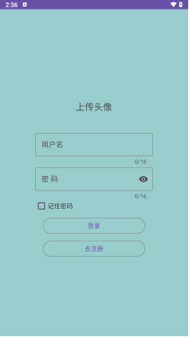
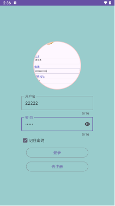
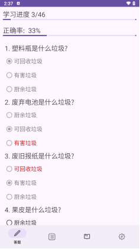
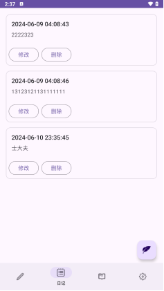
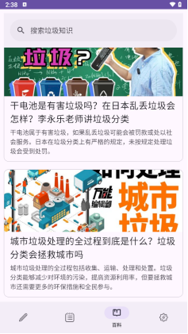
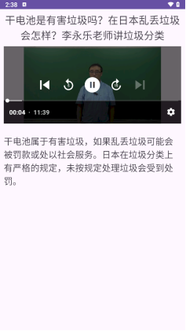
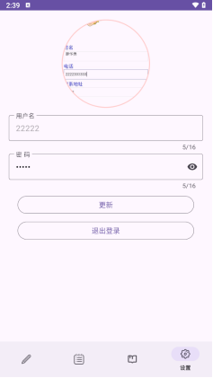
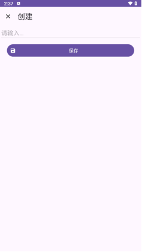

# 垃圾助手App

> 学校Android期末大作业， 使用Google官方的material组件实现。符不符合material设计规范我就不知道了(doge)
>
> 本项目使用kotlin构建，如果需要java版本，请自行更改

## 依赖

1. `dataRoom ` 处理SqLite的连接
2. `serialization-json` json解析
3. `glide` 处理图片的加载
4. `roundImageView` 圆角头像显示
5. `exoplayer` 视频播放器
6. `material` 组件

## 实现功能

1. 启动页跳转
2. 登录/注册
3. 头像上传/保存
4. 记住密码
5. 答题模块: 使用json进行题目配置，快速解析
6. 日记模块: 能够对笔记进行 增删改查
7. 百科模块: 使用json进行百科模块的配置，支持图片视频头部显示
8. 个人主页能够进行信息的更改
9. 网络搜索功能: 支持网络搜索和访问进度显示

## 申请权限

- 网络访问权限: 用于网络访问

## 如何运行

> 如果运行出来的项目里视频无法播放，请自行在asset目录里添加视频，并修改json文件里视频目录。
>
> 视频播放相关内容请看`app\src\main\java\com\example\abilitytest\activity\LearnActivity.kt`

1. 克隆本项目: `https://github.com/love-yuri/RubbishApp.git`
2. 使用Android Studio 或者 IDEA打开
3. 等待依赖下载完成
4. 直接运行即可

## 项目预览

